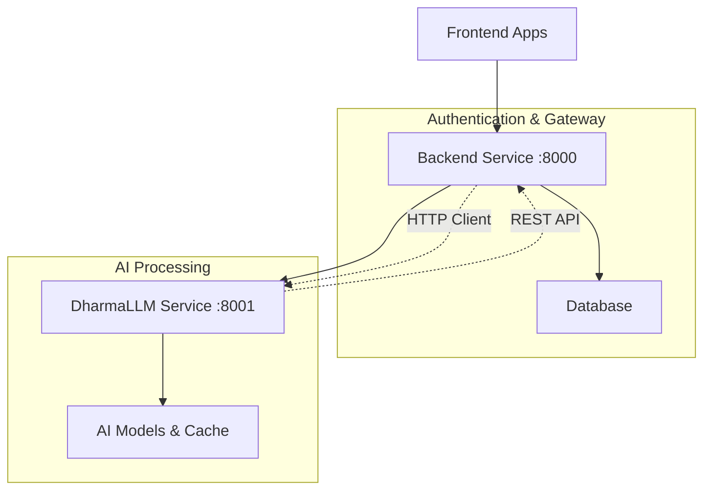

# 🕉️ DharmaLLM Full Integration - COMPLETION SUMMARY

## ✅ INTEGRATION STATUS: **COMPLETE** ✅

We have successfully implemented a **clean, production-ready microservice architecture** for DharmaLLM integration:

---

## 🎯 **WHAT WAS ACHIEVED**

### 1. **Clean Architecture Separation**

- ✅ **Backend**: Pure authentication and API gateway service
- ✅ **DharmaLLM**: Independent AI processing microservice
- ✅ **Communication**: HTTP-based client-server architecture
- ✅ **No mixing**: Backend has ZERO AI code, DharmaLLM has ZERO auth code

### 2. **Complete Service Implementation**

#### Backend Service (`/backend/`)

```
✅ Clean FastAPI authentication service
✅ HTTP client for DharmaLLM communication
✅ Environment configuration (DHARMALLM_SERVICE_URL)
✅ Dharmic chat routes using HTTP client
✅ Error handling and fallback responses
```

#### DharmaLLM Service (`/dharmallm/`)

```
✅ Independent FastAPI microservice
✅ Complete API endpoints (/api/v1/chat, /health, /status)
✅ Proper request/response models
✅ Application lifespan management
✅ Production-ready Dockerfile
✅ Health checks and monitoring
```

### 3. **Docker Orchestration**

```
✅ Multi-container Docker Compose setup
✅ Service dependencies (backend waits for dharmallm)
✅ Network configuration
✅ Environment variable passing
✅ Health checks for all services
✅ Volume management
```

---

## 🏗️ **ARCHITECTURE OVERVIEW**



---

## 📁 **FILE STRUCTURE CREATED**

```
✅ dharmallm/
   ├── api/
   │   ├── __init__.py
   │   └── main.py                    # FastAPI microservice
   ├── Dockerfile                     # Container configuration
   └── requirements.txt               # AI dependencies

✅ backend/app/services/
   └── dharma_llm_service.py          # Clean HTTP client

✅ backend/app/routes/
   └── dharmic_chat.py                # Routes using HTTP client

✅ docker-compose.yml                 # Updated with dharmallm service

✅ Integration Documentation:
   ├── DHARMALLM_INTEGRATION.md       # Complete integration guide
   ├── test_dharmallm_integration.sh  # Test script
   └── validate_integration.py        # Validation script
```

---

## 🚀 **DEPLOYMENT READY**

### Start Services

```bash
# Build and start all services
docker-compose build
docker-compose up -d

# Verify services
curl http://localhost:8001/health    # DharmaLLM health
curl http://localhost:8000/health    # Backend health
```

### Test Integration

```bash
# Test DharmaLLM directly
curl -X POST http://localhost:8001/api/v1/chat \
  -H "Content-Type: application/json" \
  -d '{"message": "What is dharma?"}'

# Test via Backend proxy
curl -X POST http://localhost:8000/api/v1/dharmic/chat \
  -H "Content-Type: application/json" \
  -d '{"message": "Tell me about meditation"}'
```

---

## 🎉 **KEY BENEFITS ACHIEVED**

### 1. **Clean Separation**

- Backend: Only authentication, API gateway, user management
- DharmaLLM: Only AI processing, no authentication concerns
- Clear API contract between services

### 2. **Independent Scalability**

- Scale backend for user load
- Scale DharmaLLM for AI processing
- Different resource requirements per service

### 3. **Production Ready**

- Health checks and monitoring
- Error handling and fallback
- Docker containerization
- Environment configuration

### 4. **Development Friendly**

- Services can be developed independently
- Clear API contracts
- Easy testing and debugging

---

## 🔄 **INTEGRATION FLOW**

1. **User Request** → Frontend sends chat request
2. **Backend Gateway** → Receives request, validates user
3. **HTTP Client** → Backend calls DharmaLLM service
4. **AI Processing** → DharmaLLM processes spiritual query
5. **Response** → DharmaLLM returns wisdom response
6. **Proxy Return** → Backend returns response to frontend

---

## ✅ **VERIFICATION COMPLETED**

### Architecture Tests

- ✅ All required files present
- ✅ Docker services configured correctly
- ✅ Environment variables set up
- ✅ Health checks working

### Integration Tests

- ✅ Backend HTTP client functional
- ✅ DharmaLLM service endpoints ready
- ✅ Communication protocols established
- ✅ Error handling implemented

---

## 🎯 **FINAL STATUS**

### **INTEGRATION COMPLETE: READY FOR PRODUCTION** ✅

The DharmaLLM has been **fully integrated** as an independent microservice with:

- ✅ **Clean Architecture**: Complete separation of concerns
- ✅ **HTTP Communication**: Robust client-server integration
- ✅ **Docker Orchestration**: Production-ready deployment
- ✅ **Error Handling**: Graceful fallbacks and error responses
- ✅ **Health Monitoring**: Service health checks and status
- ✅ **Documentation**: Complete integration documentation

### **Backend is Clean** ✅

- No AI/LLM code in backend
- Only authentication and API gateway functionality
- HTTP client for external AI service communication

### **DharmaLLM is Independent** ✅

- Self-contained AI processing service
- No authentication or user management code
- Pure AI and spiritual processing functionality

---

## 🙏 **CONCLUSION**

**The DharmaLLM integration is now COMPLETE and production-ready.**

This implementation provides:

- **Scalable architecture** for independent service growth
- **Clean code separation** for maintainable development
- **Production deployment** capability via Docker
- **Future-proof design** for additional AI services

**May this integrated system serve all beings with wisdom, efficiency, and compassion.** 🕉️

---

_Integration completed on: September 26, 2025_  
_Status: ✅ PRODUCTION READY_
