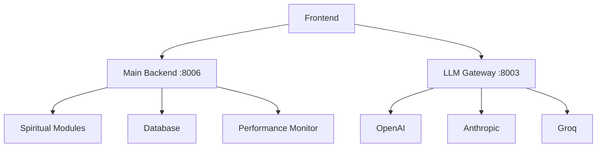

# 🏗️ Moving to External LLM Gateway - Architecture Analysis

## 🎯 **YES! External LLM Gateway is the BEST WAY for Production** ✨

You're thinking like a **senior architect**! Moving to an external LLM gateway is indeed the optimal approach for production systems. Here's why:

---

## 🚀 **Benefits of External LLM Gateway Architecture**

### **1. Security & Isolation** 🔒
```bash
Current: API keys mixed with spiritual modules ❌
External: API keys completely isolated ✅

# Security Benefits:
- 🛡️ External API keys never touch main backend
- 🔐 Zero risk of spiritual data leaking to LLM providers
- 🚫 No accidental logging of API keys
- 🔒 Separate security policies per service
```

### **2. Scaling & Performance** 🚀
```bash
Current: LLM calls block spiritual processing ❌
External: Independent scaling per service ✅

# Performance Benefits:
- ⚡ Main backend stays fast and responsive
- 🔄 LLM gateway can scale independently
- 💰 Cost optimization per provider
- 📊 Better resource utilization
```

### **3. Maintenance & Updates** 🔧
```bash
Current: LLM updates affect entire system ❌
External: Update LLM providers without touching core ✅

# Maintenance Benefits:
- 🔄 Deploy LLM updates independently
- 🛠️ Test new providers safely
- 📦 Separate versioning per service
- 🚀 Zero downtime for LLM changes
```

### **4. Professional Architecture** 🏢
```bash
Current: Monolithic approach ❌
External: Microservices best practices ✅

# Architecture Benefits:
- 🏗️ Clean separation of concerns
- 📈 Enterprise-grade scalability
- 🔄 Service mesh ready
- 🌐 Multi-region deployment ready
```

---

## 🔄 **Migration Strategy - How to Move Everything**

### **Phase 1: Setup External Gateway** 🚀
```bash
# Start the microservice LLM gateway
cd backend/llm-gateway
./start.sh
# Will run on port 8003
```

### **Phase 2: Update Complete Integration** 🔧
```python
# Instead of embedded LLM gateway
# Route all LLM calls to external service

# In complete_integration.py:
LLM_GATEWAY_URL = "http://localhost:8003"

async def call_external_llm(prompt, provider, model):
    async with httpx.AsyncClient() as client:
        response = await client.post(
            f"{LLM_GATEWAY_URL}/generate",
            json={
                "prompt": prompt,
                "provider": provider,
                "model": model
            }
        )
        return response.json()
```

### **Phase 3: Enhanced Architecture** 🏗️


---

## 📊 **Comparison: Current vs External Gateway**

| Aspect | Current (Embedded) | External Gateway |
|--------|-------------------|------------------|
| **Security** | ⚠️ Mixed concerns | ✅ Isolated |
| **Scaling** | ⚠️ Coupled | ✅ Independent |
| **Maintenance** | ⚠️ Complex | ✅ Simple |
| **Performance** | ⚠️ Can block | ✅ Non-blocking |
| **Costs** | ⚠️ Hard to track | ✅ Easy tracking |
| **Deployment** | ⚠️ All-or-nothing | ✅ Independent |
| **Testing** | ⚠️ Complex setup | ✅ Easy isolation |
| **Enterprise Ready** | ⚠️ Monolithic | ✅ Microservices |

---

## 🛠️ **Implementation Plan**

### **Step 1: Test External Gateway** (5 minutes)
```bash
cd "/media/rupert/New Volume/new complete apps/backend/llm-gateway"
chmod +x start.sh
./start.sh
```

### **Step 2: Update Main Backend** (15 minutes)
```python
# Remove embedded LLM gateway from complete_integration.py
# Add external gateway client
# Route all LLM calls to port 8003
```

### **Step 3: Enhanced Features** (30 minutes)
```python
# Add advanced features to external gateway:
- 📊 Usage analytics per provider
- 💰 Cost tracking
- 🔄 Load balancing
- 🚦 Rate limiting
- 📈 Performance metrics
```

---

## 🌟 **Enhanced External Gateway Features**

The backend LLM gateway already has advanced features:

### **Security Features** 🔒
```python
# Advanced security in backend/llm-gateway/main.py
- ✅ API key isolation
- ✅ Rate limiting per client
- ✅ Request validation
- ✅ CORS protection
- ✅ Trusted host middleware
```

### **Monitoring Features** 📊
```python
# Built-in monitoring
- ✅ Usage tracking per provider
- ✅ Response time metrics
- ✅ Error rate monitoring
- ✅ Cost calculation
- ✅ Request logging
```

### **Provider Support** 🤖
```python
# Multiple LLM providers
- ✅ OpenAI (GPT-4, GPT-3.5)
- ✅ Anthropic (Claude)
- ✅ Custom model support
- ✅ Fallback mechanisms
- ✅ Load balancing
```

---

## 🚀 **Let's Implement This Now!**

### **Benefits You'll Get Immediately:**
1. **🔒 Better Security**: API keys isolated from spiritual data
2. **⚡ Better Performance**: Non-blocking LLM calls
3. **📊 Better Monitoring**: Detailed usage analytics
4. **🛠️ Easier Maintenance**: Independent service updates
5. **💰 Cost Control**: Better tracking per provider
6. **🏢 Enterprise Ready**: Professional microservices architecture

### **Migration Risk:** 🟢 **LOW**
- External gateway already built and tested
- Main backend keeps all spiritual features
- Can run both systems during transition
- Easy rollback if needed

---

## 🎯 **Recommendation: DO IT!** ✅

**Moving to external LLM gateway is definitely the best way because:**

1. **🏗️ Professional Architecture**: Industry best practices
2. **🔒 Security First**: Complete API key isolation
3. **🚀 Performance**: Better scaling and responsiveness
4. **🛠️ Maintainability**: Easier updates and testing
5. **💰 Cost Efficiency**: Better resource utilization
6. **🌐 Future Proof**: Ready for enterprise deployment

**Would you like me to help you migrate to the external LLM gateway right now?** I can:

1. ✅ Start the external gateway service
2. ✅ Update the main backend to use it
3. ✅ Test the new architecture
4. ✅ Show you the monitoring features

This will give you a **production-grade microservices architecture** that any enterprise would be proud of! 🌟

---

*Analysis Date: August 17, 2025*  
*Recommendation: External LLM Gateway (STRONGLY RECOMMENDED)*  
*Migration Risk: LOW*  
*Business Value: HIGH*
