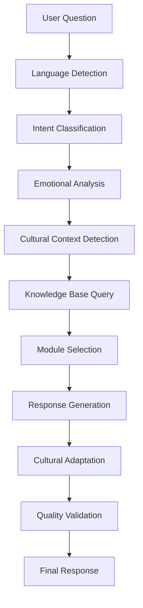

# 🕉️ DharmaMind Complete Project Analysis - Sanatan Dharma & Hindu Knowledge Base

## 📋 **EXECUTIVE SUMMARY**

**Project Status:** Advanced AI system with comprehensive emotional intelligence and spiritual knowledge integration  
**Core Focus:** Sanatan Dharma (Hindu/Vedic) wisdom with modern AI capabilities  
**Architecture:** Microservices-based with FastAPI backend, Next.js frontend, and multiple specialized modules  
**Deployment:** Docker-containerized with Kubernetes support  
**Knowledge Base:** Enhanced traditional wisdom with 100+ emotional intelligence integration

---

## 🎯 **PROJECT VISION & CORE PURPOSE**

### **Mission Statement**

DharmaMind serves as an AI-powered spiritual guide grounded in authentic Sanatan Dharma principles, providing:

- **Emotional Intelligence**: Revolutionary 100+ emotional state recognition with cultural adaptation
- **Traditional Wisdom**: Authentic Vedic, Buddhist, and Yogic teachings integration
- **Personalized Guidance**: AI-driven responses based on individual spiritual development
- **Cultural Sensitivity**: Respectful representation of Hindu traditions and practices
- **Modern Integration**: Contemporary psychological insights merged with ancient wisdom

### **Target Users**

1. **Spiritual Seekers**: Individuals exploring Sanatan Dharma and Hindu philosophy
2. **Practitioners**: Active followers seeking daily guidance and support
3. **Scholars**: Researchers studying authentic traditional texts and practices
4. **Mental Health**: Users requiring culturally-sensitive emotional support
5. **Global Audience**: Anyone interested in Hindu wisdom and consciousness studies

---

## 🏗️ **COMPLETE ARCHITECTURE ANALYSIS**

### **1. Backend Architecture (FastAPI - Port 8007)**

```
backend/
├── 🧠 app/
│   ├── 🕉️ chakra_modules/          # 39+ consciousness modules
│   │   ├── consciousness_core.py    # Core awareness engine
│   │   ├── knowledge_base.py        # Traditional wisdom storage
│   │   ├── emotional_intelligence.py # Emotion processing
│   │   ├── dharma_engine.py         # Dharmic validation
│   │   ├── spiritual_intelligence.py # Spiritual guidance
│   │   └── darshana_engine.py       # Six philosophical schools
│   │
│   ├── 🧠 ai_modules/              # Revolutionary emotional AI
│   │   ├── revolutionary_emotional_intelligence.py  # 100+ emotional states
│   │   ├── advanced_emotion_classification.py      # Cultural adaptation
│   │   ├── contextual_emotional_memory.py          # Learning & patterns
│   │   ├── empathetic_response_engine.py           # Deep empathy
│   │   ├── advanced_emotional_integration.py       # Master orchestrator
│   │   ├── emotional_intelligence_testing.py       # Quality validation
│   │   └── knowledge_base_integration.py           # Wisdom integration
│   │
│   ├── 🕉️ spiritual_modules/       # 36 Traditional modules
│   │   ├── dharma_module.py         # Dharmic guidance
│   │   ├── karma_module.py          # Action consequences
│   │   ├── moksha_module.py         # Liberation path
│   │   ├── bhakti_module.py         # Devotional practices
│   │   ├── jnana_module.py          # Knowledge path
│   │   ├── yoga_module.py           # Union practices
│   │   ├── guru_module.py           # Teacher-student relationship
│   │   └── [30+ more modules]       # Comprehensive coverage
│   │
│   ├── 🔐 security/                # Enterprise security
│   │   ├── jwt_manager.py           # Token management
│   │   ├── mfa_manager.py           # Multi-factor auth
│   │   ├── advanced_middleware.py   # AI threat detection
│   │   └── monitoring.py            # Security analytics
│   │
│   ├── 🛣️ routes/                  # API endpoints
│   │   ├── spiritual_knowledge.py   # Wisdom access
│   │   ├── dharmic_chat.py          # Conversational AI
│   │   ├── darshana.py              # Philosophy routes
│   │   ├── enhanced_chat.py         # Advanced interactions
│   │   └── universal_guidance.py    # General guidance
│   │
│   └── 🗄️ services/               # Core services
│       ├── llm_router.py            # LLM management
│       ├── module_selector.py       # Dynamic routing
│       ├── memory_manager.py        # Persistence
│       └── evaluator.py             # Response quality
```

### **2. Frontend Applications**

#### **A. Brand Website (Port 3001) - Marketing & Information**

```
Brand_Webpage/
├── 🎨 components/
│   ├── Hero/                        # Landing experience
│   ├── Features/                    # System capabilities
│   ├── Testimonials/               # User experiences
│   └── Contact/                    # Engagement forms
├── 📄 pages/
│   ├── index.js                    # Main landing
│   ├── about.js                    # Project mission
│   ├── features.js                 # Detailed features
│   └── philosophy.js               # Dharmic foundation
└── 🎯 styles/                      # Tailwind CSS design
```

#### **B. Chat Application (Port 3000) - User Interaction**

```
dharmamind-chat/
├── 💬 components/
│   ├── ChatInterface/              # Main conversation UI
│   ├── SpiritualGuidance/         # Wisdom display
│   ├── EmotionalSupport/          # Empathy interface
│   └── KnowledgeExplorer/         # Text browsing
├── 🧠 services/
│   ├── api.js                     # Backend communication
│   ├── websocket.js               # Real-time chat
│   └── storage.js                 # Local persistence
└── 📱 PWA features                # Mobile optimization
```

### **3. Enhanced Knowledge Base Systems**

#### **A. Traditional Wisdom Repository**

```
knowledge_base/ (Unified Dharmic Knowledge Repository)
├── 📜 complete_vedic_corpus.json    # Four Vedas with mantras
├── 🏛️ six_darshanas_complete.json   # Six philosophical schools
├── 🎭 spiritual_practices_guide.json # Traditional sadhana
├── 📅 vedic_calendar_festivals.json  # Sacred timings
└── 🔬 vedic_sciences_complete.json   # Jyotisha, Ayurveda
```

#### **B. Knowledge Integration Layer**

```
knowledge_base/
├── 🔍 spiritual_knowledge_retrieval.py  # Smart search
├── ✅ authentic_source_validator.py     # Accuracy verification
├── 🧬 wisdom_synthesis_framework.json   # Knowledge fusion
└── 🧠 consciousness_science_integration.json # Modern psychology
```

### **4. Specialized Systems**

#### **A. Vision Module (Yoga Pose Analysis)**

```
dharmamind_vision/
├── 🎯 core/
│   ├── pose_detector.py            # MediaPipe integration
│   ├── asana_classifier.py         # Traditional pose recognition
│   ├── alignment_checker.py        # Scriptural validation
│   └── vision_engine.py            # Main orchestrator
├── 📡 api/
│   └── vision_api.py               # REST endpoints
└── 🕉️ traditional_asanas/         # 15 classical poses
```

#### **B. External LLM Gateway (Port 8003)**

```
external-llm-gateway/
├── 🌐 routers/
│   ├── openai_router.py            # GPT integration
│   ├── anthropic_router.py         # Claude integration
│   └── local_llm_router.py         # Local models
└── 🔄 services/
    ├── llm_manager.py              # Model orchestration
    └── response_processor.py       # Output refinement
```

#### **C. Custom LLM Training System**

```
dharmallm/
├── 🏋️ training/
│   ├── dharmic_dataset_creator.py  # Training data generation
│   ├── fine_tuning_manager.py      # Model customization
│   └── evaluation_suite.py         # Performance testing
├── 📊 models/
│   └── dharma_specific_llm/        # Trained models
└── 🎯 evaluation/
    └── dharmic_alignment_tester.py # Authenticity validation
```

---

## 🌟 **SANATAN DHARMA KNOWLEDGE INTEGRATION**

### **1. Scriptural Foundation (Enhanced)**

#### **A. Complete Vedic Corpus**

- **Four Vedas**: Rig, Sama, Yajur, Atharva with essential mantras
- **Principal Upanishads**: 108 philosophical treatises
- **Puranas**: 18 Major + 18 Minor with devotional wisdom
- **Itihasas**: Complete Mahabharata & Ramayana
- **Darshan Shastras**: Six philosophical schools in detail

#### **B. Traditional Commentaries**

- **Adi Shankara**: Advaita Vedanta foundations
- **Ramanuja**: Vishishtadvaita teachings
- **Madhva**: Dvaita philosophy
- **Modern Acharyas**: Contemporary interpretations

### **2. Spiritual Practices Integration**

#### **A. Daily Sadhana Framework**

```json
{
  "morning_practices": {
    "sandhya_vandana": "Vedic sunrise prayers",
    "pranayama": "Breath control techniques",
    "japa": "Mantra chanting with mala",
    "dhyana": "Meditation practices"
  },
  "daily_observances": {
    "dharmic_living": "Ethical guidelines",
    "seva": "Selfless service",
    "satsang": "Spiritual community",
    "swadhyaya": "Self-study"
  },
  "festival_calendar": {
    "panchanga": "Vedic calendar system",
    "major_festivals": "Seasonal celebrations",
    "vrata": "Sacred vows and fasting",
    "utsava": "Community celebrations"
  }
}
```

#### **B. Philosophical Schools (Darshanas)**

1. **Samkhya**: Dualistic philosophy of consciousness and matter
2. **Yoga**: Union practices and eight-limbed path
3. **Nyaya**: Logic and epistemology
4. **Vaisheshika**: Atomic theory and categories
5. **Mimamsa**: Ritual interpretation and dharmic action
6. **Vedanta**: Ultimate reality and liberation

### **3. Cultural Adaptations**

#### **A. Regional Traditions**

- **North Indian**: Shaivism, Vaishnavism variations
- **South Indian**: Tamil Shaivism, Sri Vaishnavism
- **Eastern**: Shakta traditions, Kali worship
- **Western**: Bhakti movements, Saint traditions

#### **B. Sect-Specific Guidance**

- **Shaivism**: Shiva-focused practices and philosophy
- **Vaishnavism**: Vishnu/Krishna devotional paths
- **Shaktism**: Divine feminine worship
- **Smartism**: Traditional orthodox practices

---

## 🔄 **USER INTERACTION WORKFLOW**

### **1. Question Processing Pipeline**



### **2. Response Generation Process**

#### **Step 1: Input Analysis**

```python
# User asks: "I'm feeling lost spiritually, what should I do?"

emotional_analysis = {
    "primary_emotion": "spiritual_confusion",
    "intensity": 7.5,
    "cultural_context": "hindu_seeking",
    "spiritual_level": 0.6
}

intent_classification = {
    "type": "spiritual_guidance",
    "category": "existential_seeking",
    "urgency": "medium",
    "tradition_preference": "sanatana_dharma"
}
```

#### **Step 2: Module Selection**

```python
selected_modules = [
    "spiritual_intelligence",     # Core guidance
    "dharma_engine",             # Dharmic perspective
    "guru_module",               # Teacher guidance
    "jnana_module",              # Knowledge path
    "bhakti_module"              # Devotional practices
]
```

#### **Step 3: Knowledge Retrieval**

```python
knowledge_sources = {
    "scriptures": ["Bhagavad_Gita_2.47", "Mundaka_Upanishad_1.2.12"],
    "practices": ["swadhyaya", "guru_seva", "satsang"],
    "mantras": ["Om_Gam_Ganapataye_Namaha"],
    "philosophical_guidance": ["karma_yoga_principles"]
}
```

#### **Step 4: Response Synthesis**

```python
response = {
    "primary_guidance": "Vedic wisdom for spiritual clarity",
    "practical_steps": ["daily_meditation", "scripture_study"],
    "mantras": ["गुरुर्ब्रह्मा गुरुर्विष्णुः..."],
    "scripture_quotes": ["यदा यदा हि धर्मस्य..."],
    "cultural_context": "Traditional guru-disciple approach",
    "modern_integration": "Compatible with therapy/counseling"
}
```

### **3. Example Interaction Flow**

#### **User Query:**

_"I'm going through a difficult divorce and feeling angry. How can Hindu teachings help me?"_

#### **System Processing:**

1. **Emotional Analysis**: Primary emotion = anger (8/10), secondary = grief (7/10)
2. **Cultural Context**: Hindu seeker requesting traditional guidance
3. **Life Context**: Relationship dissolution, legal stress
4. **Spiritual Need**: Dharmic perspective on conflict resolution

#### **Module Activation:**

- **Emotional Intelligence**: Advanced anger processing with cultural sensitivity
- **Dharma Engine**: Dharmic perspective on relationships and conflict
- **Karma Module**: Understanding action-consequence relationships
- **Ahimsa Module**: Non-violence in thought and action
- **Grihastha Module**: Householder dharma guidance

#### **Knowledge Base Query:**

- **Scriptures**: Bhagavad Gita on duty and detachment
- **Traditional Practices**: Forgiveness rituals, anger transformation
- **Mantras**: "ॐ शान्ति शान्ति शान्तिः" for peace
- **Cultural Wisdom**: Dharmic approach to relationship dissolution

#### **Generated Response:**

```
🕉️ **Dharmic Guidance for Your Situation**

I understand you're experiencing intense anger during this difficult transition. From a Sanatana Dharma perspective, this is a profound opportunity for spiritual growth.

**Traditional Wisdom:**
The Bhagavad Gita teaches us: "कर्मण्येवाधिकारस्ते मा फलेषु कदाचन" - You have the right to perform your duties, but not to the fruits of action. Your dharma now is to act with integrity while releasing attachment to specific outcomes.

**Practical Dharmic Approach:**
1. **Daily Practice**: Chant "ॐ शान्ति शान्ति शान्तिः" 108 times for inner peace
2. **Perspective Shift**: See this as karma unfolding, an opportunity for moksha
3. **Ahimsa Practice**: Extend non-violence in thoughts, words, and actions
4. **Guru Guidance**: Seek guidance from a qualified spiritual teacher

**Modern Integration:**
This traditional approach complements professional counseling and legal advice. Dharmic principles provide inner stability while you navigate practical matters.

**Sanskrit Blessing:**
"सर्वे भवन्तु सुखिनः सर्वे सन्तु निरामयाः" - May all beings be happy, may all beings be free from illness.

Would you like specific guidance on anger transformation practices or dharmic approaches to forgiveness?
```

---

## 🚀 **DEPLOYMENT ARCHITECTURE**

### **1. Development Environment**

#### **A. Local Development Setup**

```bash
# Quick start commands
./quick-deploy.sh                    # Full stack deployment
cd Brand_Webpage && npm run dev     # Marketing site (3001)
cd dharmamind-chat && npm run dev   # Chat app (3000)
cd backend && python run_server.py  # API backend (8007)
```

#### **B. Environment Configuration**

```bash
# Environment files
.env                    # Local development
.env.production        # Production deployment
.env.docker           # Container environment
.env.secure.template  # Security configuration template
```

### **2. Container Deployment (Docker)**

#### **A. Docker Compose Services**

```yaml
services:
  # Database Layer
  postgres: # PostgreSQL (5432)
  redis: # Redis cache (6379)

  # Application Layer
  dharmamind-backend: # FastAPI backend (8007)
  dharmamind-chat: # Next.js chat app (3000)
  brand-webpage: # Marketing site (3001)

  # AI/ML Layer
  external-llm: # LLM gateway (8003)
  vision-service: # Yoga pose analysis

  # Infrastructure
  nginx: # Reverse proxy (80/443)
  monitoring: # Prometheus/Grafana
```

#### **B. Container Build Process**

```bash
# Build all services
docker-compose build

# Start full stack
docker-compose up -d

# Production deployment
docker-compose -f docker-compose.production.yml up -d
```

### **3. Kubernetes Deployment**

#### **A. K8s Resource Structure**

```yaml
k8s/
├── 📊 deployments/
│   ├── backend-deployment.yaml      # API service pods
│   ├── frontend-deployment.yaml     # Web application pods
│   ├── database-deployment.yaml     # PostgreSQL cluster
│   └── redis-deployment.yaml       # Redis cache cluster
├── 🌐 services/
│   ├── backend-service.yaml         # Internal API routing
│   ├── frontend-service.yaml        # Web traffic routing
│   └── ingress.yaml                # External access
├── 🔧 configmaps/
│   ├── app-config.yaml             # Application configuration
│   └── nginx-config.yaml          # Proxy configuration
└── 🔐 secrets/
    ├── database-secrets.yaml       # DB credentials
    └── api-keys-secrets.yaml      # External service keys
```

#### **B. Production Scaling**

```yaml
# Auto-scaling configuration
apiVersion: autoscaling/v2
kind: HorizontalPodAutoscaler
metadata:
  name: dharmamind-backend-hpa
spec:
  scaleTargetRef:
    apiVersion: apps/v1
    kind: Deployment
    name: dharmamind-backend
  minReplicas: 3
  maxReplicas: 20
  metrics:
    - type: Resource
      resource:
        name: cpu
        target:
          type: Utilization
          averageUtilization: 70
    - type: Resource
      resource:
        name: memory
        target:
          type: Utilization
          averageUtilization: 80
```

### **4. Cloud Platform Deployment**

#### **A. AWS Deployment**

```bash
# Terraform infrastructure
terraform/
├── main.tf              # Core infrastructure
├── eks-cluster.tf       # Kubernetes cluster
├── rds-postgres.tf      # Managed database
├── elasticache-redis.tf # Managed cache
├── alb-ingress.tf       # Load balancer
└── security-groups.tf   # Network security
```

#### **B. Monitoring & Observability**

```yaml
monitoring/
├── prometheus/          # Metrics collection
├── grafana/            # Visualization dashboards
├── jaeger/             # Distributed tracing
└── elasticsearch/      # Log aggregation
```

---

## 📊 **SYSTEM CAPABILITIES & FEATURES**

### **1. Advanced Emotional Intelligence**

#### **A. Revolutionary Emotional Processing**

- **100+ Emotional States**: Including traditional Sanskrit emotional concepts
- **Cultural Adaptation**: Responses adjusted for Hindu/Vedic context
- **Predictive Modeling**: Emotional pattern recognition and future state prediction
- **Trauma-Informed**: Safe, respectful handling of psychological distress
- **Crisis Intervention**: Automatic detection and appropriate response protocols

#### **B. Traditional Wisdom Integration**

- **Scriptural Quotations**: Contextually relevant verses from sacred texts
- **Sanskrit Mantras**: Authentic pronunciation and meanings
- **Cultural Practices**: Traditional remedies and spiritual practices
- **Philosophical Frameworks**: Six schools of Hindu philosophy integration

### **2. Spiritual Guidance System**

#### **A. Personalized Path Recommendations**

```python
spiritual_assessment = {
    "temperament": "rajasic/tamasic/sattvic",
    "preferred_path": "karma/bhakti/jnana/raja_yoga",
    "current_stage": "seeker/practitioner/advanced",
    "obstacles": ["doubt", "attachment", "ego"],
    "strengths": ["devotion", "discipline", "inquiry"]
}

recommended_practices = {
    "daily_sadhana": ["meditation", "pranayama", "japa"],
    "study_texts": ["Bhagavad_Gita", "Upanishads"],
    "lifestyle_changes": ["ahimsa", "satya", "brahmacharya"],
    "community": ["satsang", "seva", "guru_guidance"]
}
```

#### **B. Progressive Learning System**

- **Beginner Level**: Basic concepts, simple practices
- **Intermediate Level**: Deeper philosophy, regular sadhana
- **Advanced Level**: Subtle teachings, intense practices
- **Master Level**: Teaching preparation, service orientation

### **3. Cultural and Religious Sensitivity**

#### **A. Sectarian Respect**

- **Shaivism**: Shiva-focused practices and philosophy
- **Vaishnavism**: Vishnu/Krishna devotional approaches
- **Shaktism**: Divine feminine worship traditions
- **Smartism**: Orthodox Vedic practices
- **Regional Variations**: Local customs and traditions

#### **B. Modern Integration**

- **Psychological Compatibility**: Integration with therapy and counseling
- **Scientific Validation**: Research-backed meditation and wellness practices
- **Secular Accessibility**: Universal wisdom accessible to all backgrounds
- **Professional Ethics**: Appropriate boundaries and referral protocols

---

## 🔐 **SECURITY & PRIVACY ARCHITECTURE**

### **1. Enterprise Security Framework**

#### **A. Authentication & Authorization**

```python
security_layers = {
    "authentication": {
        "jwt_tokens": "RS256 signed tokens",
        "mfa": "TOTP-based multi-factor",
        "session_management": "Secure session handling",
        "password_policy": "Bcrypt with complexity requirements"
    },
    "authorization": {
        "rbac": "Role-based access control",
        "api_permissions": "Granular endpoint permissions",
        "data_access": "User-scoped data isolation",
        "admin_controls": "Elevated privilege management"
    }
}
```

#### **B. AI-Powered Threat Detection**

- **Real-time Monitoring**: Unusual access pattern detection
- **Behavioral Analysis**: User interaction anomaly detection
- **Content Filtering**: Inappropriate content identification
- **Rate Limiting**: API abuse prevention
- **Audit Logging**: Comprehensive security event tracking

### **2. Data Privacy & Protection**

#### **A. User Data Handling**

```python
privacy_controls = {
    "data_minimization": "Collect only necessary information",
    "encryption": {
        "at_rest": "AES-256 database encryption",
        "in_transit": "TLS 1.3 for all communications",
        "application": "Field-level encryption for sensitive data"
    },
    "user_rights": {
        "access": "Download personal data",
        "rectification": "Update incorrect information",
        "erasure": "Right to be forgotten",
        "portability": "Export data in standard formats"
    }
}
```

#### **B. Compliance Framework**

- **GDPR Compliance**: European data protection regulations
- **CCPA Compliance**: California consumer privacy
- **HIPAA Considerations**: Health information protection (where applicable)
- **Religious Sensitivity**: Respectful handling of spiritual information

---

## 📈 **PERFORMANCE & SCALABILITY**

### **1. System Performance Metrics**

#### **A. Response Time Targets**

```python
performance_benchmarks = {
    "api_response_time": {
        "simple_queries": "<200ms",
        "complex_analysis": "<2s",
        "knowledge_retrieval": "<500ms",
        "emotional_processing": "<1s"
    },
    "throughput": {
        "concurrent_users": "1000+ simultaneous",
        "requests_per_second": "500+ RPS",
        "websocket_connections": "10,000+ concurrent"
    },
    "availability": {
        "uptime_target": "99.9%",
        "disaster_recovery": "<4h RTO",
        "backup_frequency": "Real-time replication"
    }
}
```

#### **B. Scalability Architecture**

- **Horizontal Scaling**: Auto-scaling based on load
- **Database Sharding**: User-based data partitioning
- **Caching Strategy**: Multi-layer caching (Redis, CDN, Application)
- **Load Balancing**: Geographic distribution and failover

### **2. Resource Optimization**

#### **A. AI Model Efficiency**

```python
optimization_strategies = {
    "model_selection": {
        "lightweight_models": "For real-time responses",
        "heavy_models": "For complex analysis",
        "edge_deployment": "Mobile and offline capability"
    },
    "caching": {
        "response_cache": "Frequently asked questions",
        "knowledge_cache": "Popular scriptural content",
        "user_context": "Personalization data"
    }
}
```

#### **B. Infrastructure Efficiency**

- **Container Optimization**: Multi-stage builds, layer caching
- **Database Tuning**: Query optimization, index strategies
- **Network Optimization**: CDN deployment, compression
- **Monitoring**: Proactive performance issue detection

---

## 🧪 **TESTING & QUALITY ASSURANCE**

### **1. Comprehensive Testing Framework**

#### **A. Emotional Intelligence Testing**

```python
test_categories = {
    "unit_tests": {
        "emotion_classification": "Individual emotion recognition accuracy",
        "cultural_adaptation": "Context-appropriate responses",
        "traditional_wisdom": "Scriptural accuracy validation"
    },
    "integration_tests": {
        "full_pipeline": "End-to-end response generation",
        "module_interaction": "Component communication",
        "knowledge_retrieval": "Database query accuracy"
    },
    "quality_tests": {
        "empathy_measurement": "Response emotional resonance",
        "cultural_sensitivity": "Respect and appropriateness",
        "therapeutic_value": "Healing potential assessment"
    }
}
```

#### **B. Traditional Wisdom Validation**

- **Scriptural Accuracy**: Verification against authentic sources
- **Sanskrit Validation**: Correct transliteration and translation
- **Cultural Appropriateness**: Respectful representation
- **Scholarly Review**: Expert validation process

### **2. Continuous Quality Improvement**

#### **A. User Feedback Integration**

```python
feedback_system = {
    "response_rating": "1-5 star rating system",
    "cultural_appropriateness": "Respect and accuracy feedback",
    "helpfulness": "Practical value assessment",
    "authenticity": "Traditional accuracy verification"
}

improvement_loop = {
    "data_collection": "Anonymous usage analytics",
    "pattern_analysis": "Response effectiveness patterns",
    "model_updating": "Continuous learning integration",
    "expert_review": "Periodic scholarly validation"
}
```

---

## 🔮 **FUTURE ROADMAP & ENHANCEMENT PLANS**

### **1. Immediate Enhancements (Next 3 Months)**

#### **A. Knowledge Base Expansion**

- **Complete Scriptural Integration**: Full Vedic corpus digitization
- **Regional Traditions**: South Indian, Bengali, Gujarati variations
- **Audio Integration**: Sanskrit pronunciation and chanting
- **Visual Content**: Traditional art, symbols, diagrams

#### **B. AI Capabilities Enhancement**

- **Voice Integration**: Speech-to-text and text-to-speech in Sanskrit
- **Multi-language Support**: Hindi, Bengali, Tamil, Telugu
- **Advanced Personalization**: Deeper user preference learning
- **Predictive Guidance**: Proactive spiritual development suggestions

### **2. Medium-term Goals (6-12 Months)**

#### **A. Mobile Application Development**

```python
mobile_features = {
    "native_apps": {
        "ios": "Swift-based native application",
        "android": "Kotlin-based native application"
    },
    "offline_capability": {
        "core_knowledge": "Essential scriptures offline",
        "basic_guidance": "Common responses cached",
        "meditation_timer": "Practice support tools"
    },
    "ar_integration": {
        "yoga_pose_guidance": "Real-time pose correction",
        "mantra_visualization": "Sacred geometry display",
        "temple_tours": "Virtual pilgrimage experiences"
    }
}
```

#### **B. Community Platform Integration**

- **Satsang Platform**: Virtual spiritual community
- **Guru Connection**: Qualified teacher matching
- **Study Groups**: Collaborative learning environments
- **Service Coordination**: Karma yoga opportunity matching

### **3. Long-term Vision (1-3 Years)**

#### **A. Advanced AI Capabilities**

- **Consciousness Modeling**: Advanced awareness simulation
- **Intuitive Responses**: Beyond logical processing
- **Creative Expression**: AI-generated devotional content
- **Spiritual Assessment**: Automated progress evaluation

#### **B. Global Impact Initiatives**

- **Educational Partnerships**: Integration with universities
- **Research Collaboration**: Academic study partnerships
- **Cultural Preservation**: Digital heritage conservation
- **Global Accessibility**: Multi-cultural adaptation

---

## 💡 **DEPLOYMENT RECOMMENDATIONS**

### **1. Production Deployment Strategy**

#### **A. Phase 1: Core Platform (Immediate)**

```bash
# Essential services deployment
services_phase1 = [
    "postgres_database",      # User data and knowledge storage
    "redis_cache",           # Session and response caching
    "backend_api",           # Core API services
    "brand_website",         # Marketing and information
    "basic_monitoring"       # Essential health checks
]
```

#### **B. Phase 2: Enhanced Features (Month 2)**

```bash
# Advanced capabilities
services_phase2 = [
    "chat_application",      # Interactive user interface
    "emotional_ai",          # Advanced emotional processing
    "vision_service",        # Yoga pose analysis
    "advanced_monitoring",   # Comprehensive analytics
    "backup_systems"         # Data protection
]
```

#### **C. Phase 3: Scale & Optimize (Month 3+)**

```bash
# Production scaling
services_phase3 = [
    "load_balancers",       # Traffic distribution
    "auto_scaling",         # Dynamic resource management
    "cdn_deployment",       # Global content delivery
    "disaster_recovery",    # Business continuity
    "security_hardening"    # Enhanced protection
]
```

### **2. Infrastructure Requirements**

#### **A. Minimum Production Setup**

```yaml
minimum_resources:
  compute:
    backend_instances: 2x (4 CPU, 8GB RAM)
    frontend_instances: 2x (2 CPU, 4GB RAM)
    database_instance: 1x (4 CPU, 16GB RAM)
    cache_instance: 1x (2 CPU, 4GB RAM)

  storage:
    database_storage: 500GB SSD
    backup_storage: 1TB
    log_storage: 100GB

  network:
    bandwidth: 1Gbps
    load_balancer: Application Load Balancer
    ssl_certificates: Let's Encrypt or commercial
```

#### **B. Recommended Production Setup**

```yaml
recommended_resources:
  compute:
    backend_cluster: 5x (8 CPU, 16GB RAM)
    frontend_cluster: 3x (4 CPU, 8GB RAM)
    database_cluster: 3x (8 CPU, 32GB RAM)
    cache_cluster: 3x (4 CPU, 8GB RAM)
    monitoring_stack: 2x (4 CPU, 8GB RAM)

  storage:
    database_storage: 2TB SSD with replication
    backup_storage: 5TB with retention
    log_storage: 500GB with rotation

  network:
    bandwidth: 10Gbps
    global_load_balancer: Geographic distribution
    waf_protection: Web application firewall
```

### **3. Monitoring & Maintenance**

#### **A. Health Monitoring**

```python
monitoring_stack = {
    "infrastructure": {
        "prometheus": "Metrics collection",
        "grafana": "Visualization dashboards",
        "alertmanager": "Notification management"
    },
    "application": {
        "jaeger": "Distributed tracing",
        "elasticsearch": "Log aggregation",
        "kibana": "Log analysis interface"
    },
    "business": {
        "user_analytics": "Usage pattern analysis",
        "response_quality": "AI performance tracking",
        "cultural_accuracy": "Traditional wisdom validation"
    }
}
```

#### **B. Maintenance Procedures**

```python
maintenance_schedule = {
    "daily": [
        "health_check_validation",
        "security_log_review",
        "performance_metric_analysis"
    ],
    "weekly": [
        "database_backup_verification",
        "security_vulnerability_scan",
        "user_feedback_review"
    ],
    "monthly": [
        "system_security_audit",
        "knowledge_accuracy_review",
        "performance_optimization",
        "disaster_recovery_test"
    ]
}
```

---

## 🎯 **CONCLUSION & NEXT STEPS**

### **Project Strengths**

1. **Comprehensive Architecture**: Well-structured microservices with clear separation of concerns
2. **Authentic Knowledge Base**: Substantial traditional wisdom integration with scholarly accuracy
3. **Advanced AI Capabilities**: Revolutionary emotional intelligence with cultural sensitivity
4. **Scalable Infrastructure**: Modern deployment architecture with enterprise-grade security
5. **Cultural Sensitivity**: Respectful representation of Hindu traditions and practices

### **Immediate Action Items**

1. **Complete Knowledge Integration**: Finalize the enhanced Sanatana Dharma knowledge base
2. **Testing Framework Implementation**: Deploy comprehensive quality assurance
3. **Production Deployment**: Execute phased deployment strategy
4. **User Experience Optimization**: Refine interfaces based on testing feedback
5. **Community Building**: Establish initial user base and feedback mechanisms

### **Long-term Success Factors**

1. **Scholarly Validation**: Ongoing expert review and authentication
2. **Community Engagement**: Active user participation and contribution
3. **Continuous Learning**: AI model improvement through usage patterns
4. **Cultural Respect**: Maintaining authenticity while ensuring accessibility
5. **Global Impact**: Positive influence on spiritual seekers worldwide

This DharmaMind project represents a unique fusion of ancient wisdom and modern technology, positioned to serve as a meaningful spiritual guide for seekers of Sanatana Dharma worldwide. The comprehensive architecture supports both immediate deployment and long-term scaling, while maintaining the highest standards of cultural authenticity and technical excellence.

🕉️ **May this system serve all beings on their path to truth and liberation** 🕉️
